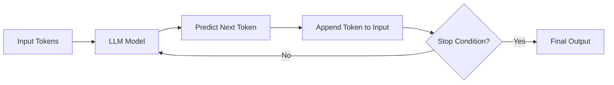

# **Chapter 0 — Understanding LLMs**

Before building agents, tools, or memory systems, we need to answer a fundamental question:

> **What exactly is an LLM?**

And more importantly:

- How does it generate human-like text?
- Is it actually intelligent?
- Why does it feel like it is “thinking”?

---

## **The Simplest Explanation**

At their core, **LLMs are autocomplete systems**—but extremely powerful ones.

An LLM does **one job**:

> **Given some text, predict the most likely next token.**

That’s it.

No awareness.
No consciousness.
No understanding—at least not in the human sense.

Yet, because these predictions are **statistically very accurate**, the output _feels_ intelligent.

---

## **Tokens, Not Words**

LLMs do not think in words or sentences.
They operate on **tokens**.

A token can be:

- A word
- Part of a word
- Punctuation
- Or even whitespace

When you send text to an LLM, it is first converted into a **sequence of tokens**.
The model then predicts **the next token** in that sequence.

---

## **How Text Is Generated (Step by Step)**

Let’s say we provide the model with this input:

> “The sky is”

The model predicts the most likely next token, such as:

> “blue”

Now the input becomes:

> “The sky is blue”

That updated text is fed back into the model again.

This loop continues **token by token**, until a stopping condition is met.

---

## **Token Prediction Loop**

Here’s a simplified visualization of how this process works internally:



### Key Insight:

The model is **not generating text all at once**.
It is predicting **one token at a time**, repeatedly.

This is why you see responses appear _sequentially_ in chat interfaces like ChatGPT.

---

## **When Does the Model Stop?**

The generation process stops when one of the following happens:

- A **stop token** is generated
- A **maximum token limit** is reached
- A custom **stop word** is encountered

In most conversational systems, a common stop token is something like:

```
assistant:
```

When the model predicts that token, the system knows:

> “The assistant’s turn is complete.”

---

## **Why It Feels Like a Conversation**

Most modern LLM applications don’t send a single sentence as input.
They send an **entire dialog history**.

Example input sent to the model:

```
user: What is an LLM?
assistant: An LLM is a large language model trained to predict tokens.
user: How does it work?
assistant:
```

The model’s task is simply:

> **Predict what comes after `assistant:`**

---

## **Dialog Flow Example**

Let’s break down a real dialog flow:

### Input Sent to the Model

```
system: You are a helpful AI assistant.
user: Explain what an LLM is in simple terms.
assistant:
```

### Model Prediction (Token by Token)

```
assistant: An
assistant: An LLM
assistant: An LLM is
assistant: An LLM is a
assistant: An LLM is a model
...
```

Each step is a **probability-based token prediction**, not a pre-planned sentence.

---

## **Are LLMs Intelligent?**

This is the wrong question.

A better question is:

> **Can statistical pattern prediction produce intelligent-seeming behavior?**

LLMs:

- Do not reason like humans
- Do not “know” facts
- Do not understand meaning

Yet, when combined with:

- Memory
- Tools
- Retrieval
- Constraints
- Feedback loops

They can **simulate reasoning extremely well**.

And that is exactly where **agentic systems** begin.

---

## **What Comes Next**

Now that we understand:

- What an LLM actually does
- How token prediction works
- Why chat feels conversational

We are ready to move forward.

In the next chapter, we’ll explore:

- How prompts shape behavior
- Why system messages matter
- And how small design decisions dramatically affect output

This is where Artemis truly begins.
