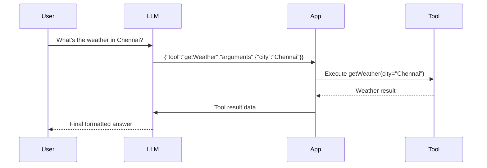

# **Chapter 1 — Talking to an LLM**

In the previous chapter, we learned that an LLM is fundamentally a **token prediction engine**.
But an important question still remains:

> **How do we actually talk to an LLM from our code?**

In this chapter, we will explore:

- How LLMs are accessed through APIs
- What an API key is and why it exists
- How messages are sent to models hosted on remote servers
- How **tool calling** works—and why it is the foundation of agentic systems

---

## **Where Does the LLM Actually Run?**

When you use ChatGPT, the model does **not** run on your device.

Instead:

- The model runs on **powerful servers** (GPUs / TPUs)
- You send your input over the internet
- The server runs inference
- You receive the generated output

From a developer’s perspective, this interaction happens through an **HTTP API**.

---

## **The Basic Mental Model**

Think of an LLM API like a very smart function hosted remotely:

```text
input (messages) ──▶ OpenAI / Model Server ──▶ output (assistant message)
```

You:

1. Send structured input (messages)
2. Specify which model to use
3. Receive a structured response

---

## **API Keys — Your Identity**

An **API key** is how the server knows:

- Who you are
- How much usage to bill
- Whether you are authorized to access the service

You usually:

- Generate an API key from the provider dashboard
- Store it securely as an environment variable
- Never hardcode it in your source code

Example (Linux / macOS):

```bash
export API_KEY="your_api_key_here"
```

In Python, this key can be accessed using `os.environ`.

---

## **The Chat Completion Format**

Most modern LLM APIs use a **chat-based format**, even if you’re not building a chatbot.

A request typically contains:

- A **model**
- A list of **messages**

Each message has:

- A `role`: `system`, `user`, or `assistant`
- A `content` string

Example:

```json
[
  { "role": "system", "content": "You are a helpful assistant." },
  { "role": "user", "content": "What is an LLM?" }
]
```

The model’s job is simple:

> **Predict the next `assistant` message.**

---

## **Calling an LLM from Python**

Let’s start with a minimal Python function that calls a chat completion API.

```python
import os
import requests

API_URL = "https://openrouter.ai/api/v1/chat/completions"
API_KEY = os.environ.get("API_KEY")

def call_llm(messages, model="x-ai/grok-4-fast"):
    response = requests.post(
        API_URL,
        headers={
            "Content-Type": "application/json",
            "Authorization": f"Bearer {API_KEY}",
        },
        json={
            "model": model,
            "messages": messages,
        },
        timeout=30,
    )
    response.raise_for_status()
    return response.json()
```

At this point:

- We can send messages
- We can receive text
- But the model is still **passive**

To build an _agent_, we need more.

---

## **Why Tool Calling Exists**

LLMs:

- Cannot access the internet on their own
- Cannot query databases
- Cannot call APIs
- Cannot execute code

Yet, we _want_ them to behave as if they can.

Tool calling is the bridge.

---

## **What Is Tool Calling?**

Tool calling is a pattern where:

1. The LLM **decides** a tool should be used
2. The LLM outputs a **structured JSON instruction**
3. Your code executes the tool
4. The result is sent back to the LLM
5. The LLM formats a final response

The model never _executes_ tools—it only **describes intent**.

---

## **High-Level Tool Flow**



This loop is the **core of agentic AI**.

---

## **Defining a Tool (Python)**

We’ll start by defining a schema and a fake weather tool.

```python
from typing import Dict

def get_weather(arguments: Dict):
    city = arguments["city"]

    fake_db = {
        "Chennai": {"temp": 32, "condition": "Humid"},
        "London": {"temp": 12, "condition": "Cloudy"},
    }

    result = fake_db.get(city, {"temp": 22, "condition": "Unknown"})
    print("➡️ TOOL CALLED WITH:", arguments)

    return {"city": city, **result}
```

---

## **Teaching the Model About the Tool**

The model must be told:

- What tools exist
- When to use them
- What format to respond in

We do this via the **system prompt**.

```python
SYSTEM_PROMPT = """
You are an AI assistant that uses implicit tool calling.

Available tool:
{
  "name": "getWeather",
  "input_schema": {
    "type": "object",
    "properties": {
      "city": { "type": "string" }
    },
    "required": ["city"]
  },
  "returns": "Weather data for that city"
}

Whenever the user asks for weather, return ONLY a JSON object:
{
  "tool": "getWeather",
  "arguments": { ... }
}
No explanations.
"""
```

This prompt acts like a **contract**.

---

## **Step 1 — Let the Model Decide**

```python
first_response = call_llm([
    {"role": "system", "content": SYSTEM_PROMPT},
    {"role": "user", "content": "What's the weather in Chennai?"}
])

tool_call = first_response["choices"][0]["message"]["content"]
tool_call = eval(tool_call)  # safe here because we control the prompt
```

Expected output:

```json
{
  "tool": "getWeather",
  "arguments": { "city": "Chennai" }
}
```

At this point:

- The model has **not answered the user**
- It has only expressed **intent**

---

## **Step 2 — Execute the Tool**

```python
tool_result = get_weather(tool_call["arguments"])
```

Example result:

```json
{
  "city": "Chennai",
  "temp": 32,
  "condition": "Humid"
}
```

---

## **Step 3 — Send the Result Back**

```python
final_response = call_llm([
    {"role": "system", "content": SYSTEM_PROMPT},
    {"role": "user", "content": "What's the weather in Chennai?"},
    {"role": "assistant", "content": str(tool_call)},
    {
        "role": "user",
        "content": f"""
Weather tool responded with the following data.
Use it to format the final response:
{tool_result}
"""
    }
])

print("🎉 FINAL ANSWER:", final_response["choices"][0]["message"]["content"])
```

Now the model produces a **human-readable answer**.

---

## **Why This Matters**

This pattern unlocks everything:

- Web search
- Memory retrieval
- Database queries
- File processing
- Scheduling tasks
- Multi-step reasoning

An **agent** is simply:

> An LLM + tools + memory + control flow

---

## **Key Takeaways**

- LLMs are accessed through remote APIs
- API keys identify and authorize your usage
- Chat completions are structured dialogs
- Tool calling lets LLMs _control_ your system safely
- The model never executes tools—it only decides

---

## **What’s Next**

In the next chapter, we’ll explore:

- Prompt roles (`system`, `user`, `assistant`) in depth
- Why system prompts are powerful
- How small prompt changes lead to big behavioral shifts

This is where **control** truly begins.
