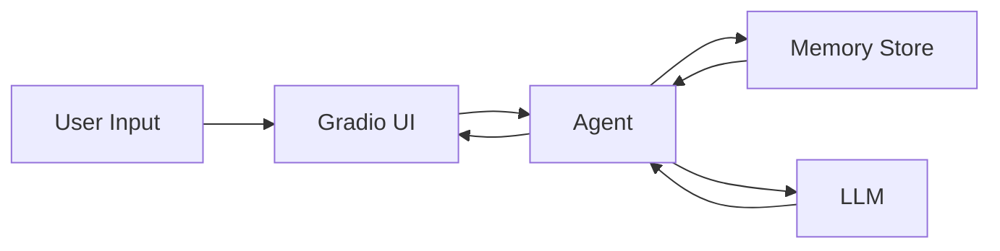

# **Chapter 4 — Memory, Context Windows, and Conversation Management**

In Chapter 0, we learned a fundamental truth about LLMs:

> **LLMs do not have memory.**

They do not remember past conversations, users, or previous answers.
Every request is stateless unless _we_ make it stateful.

The only way an LLM can “remember” something is if we **send that information again** as part of the prompt.

---

## **How We Handled Memory So Far**

Until now, Artemis handled conversation continuity by:

- Collecting all previous messages
- Re-sending them to the LLM along with the new user query

This worked because:

- Conversations were short
- Token usage was low
- We were manually controlling message replay

But this approach has a serious limitation.

---

## **The Problem: Context Windows**

Every LLM has a **context window**.

This is the maximum number of tokens the model can see at once.

If we blindly keep appending messages:

- Prompts become expensive
- Latency increases
- Eventually, the model will **reject the request**

Different models have different limits, but the rule is universal:

> **Unbounded history breaks agent systems.**

To build a real assistant, we need **controlled memory**, not infinite memory.

---

## **Introducing Managed Conversation Memory**

Instead of manually reconstructing the entire dialog every time, Artemis now:

- Lets the agent manage conversation state
- Persists messages per user (or thread)
- Actively trims old messages when limits are reached

This is a major architectural shift.

---

## **Thread-Based Conversations**

In `backend/main.py`, you’ll notice a new concept:

```python
thread_id = "1"  # hard coded for simplicity, replace it later!
```

This `thread_id` represents a **conversation session**.

In real systems, this could be:

- A user ID
- A chat session ID
- A device ID

For now, it is hardcoded to keep the example simple.

---

## **Passing Thread Context to the Agent**

The message handler has changed significantly.

### **`backend/agent/message_handler.py`**

```python
def handle_message(agent: Any, last_message: str, user_id: str):
    request = [HumanMessage(last_message)]

    response = agent.invoke(
        {"messages": request},
        {"configurable": {"thread_id": user_id}}
    )

    return response["messages"][-1].content
```

Key change:

- We no longer replay the full history manually
- The agent manages conversation state internally
- `thread_id` tells the agent _which conversation this belongs to_

This allows Artemis to scale beyond a single-turn system.

---

## **Where Is the Memory Stored?**

Memory storage is defined in a dedicated module.

### **`backend/memory/storage.py`**

```python
from langgraph.checkpoint.memory import InMemorySaver


def get_memory_saver():
    return InMemorySaver()  # replace it with sqlite memory saver later
```

Currently:

- Memory lives in RAM
- It resets when the app restarts

This is intentional for learning purposes.

Later chapters will replace this with:

- SQLite
- Redis
- Vector databases

---

## **Why a Global Config Object Exists**

Memory should **not** be recreated on every request.

That’s why Artemis introduces a global configuration object.

### **`backend/config/__init__.py`**

```python
settings = ArtemisConfig()  # global object to prevent memory being recreated
```

This ensures:

- One memory store per application
- Consistent conversation state
- Predictable behavior across requests

---

## **Enforcing Conversation Limits**

Now that memory persists, we need a way to **control its size**.

This is handled via middleware.

---

## **Trimming Messages with Middleware**

### **`backend/memory/__init__.py`**

```python
@before_model
def trim_messages(state: AgentState, runtime: Runtime):
    messages = state["messages"]
    remove_messages = []

    for message in messages[::-1][settings.max_conversation_limit:]:
        remove_messages.append(RemoveMessage(id=message.id))

    return {"messages": remove_messages}
```

What this does:

- Keeps only the most recent messages
- Removes older ones before the model is called
- Prevents context window overflow

This happens **automatically**, without the UI knowing.

---

## **Configurable Conversation Limits**

The maximum conversation size is now configurable.

```python
self.max_conversation_limit = environ.get("MAX_CONVERSATION_LIMIT", 50)
```

This allows you to:

- Tune memory depth per deployment
- Adjust cost vs recall tradeoffs
- Support different models with different limits

---

## **Agent Creation with Memory Support**

Finally, everything is wired together in the agent factory.

### **`backend/agent/__init__.py`**

```python
agent = create_agent(
    llm,
    tools=tools,
    system_prompt="You are a helpful assistant",
    checkpointer=settings.checkpointer,
    middleware=[trim_messages],
)
```

This single line enables:

- Persistent conversation memory
- Controlled context size
- Thread-aware interactions

The UI remains completely unchanged.

---

## **End-to-End Memory Flow**

Here’s what happens now when a user sends a message:

1. User sends input
2. Agent loads messages for that thread
3. Middleware trims old messages
4. LLM processes recent context
5. New messages are stored
6. Response is returned



---

## **What We’ve Achieved**

With this chapter, Artemis now has:

- Persistent conversation memory
- Thread-based session handling
- Automatic context trimming
- Configurable memory limits
- Zero UI complexity added

This is a **major milestone**.

---

## **Key Takeaways**

- LLMs do not remember — systems do
- Unlimited history is not scalable
- Memory must be intentional and bounded
- Middleware is the right place for context control
- Thread IDs are foundational for multi-user agents

---

## **What’s Next**

Memory alone is not enough.

In the next chapter, we’ll explore:

- Long-term memory vs short-term memory
- Storing structured facts about users
- Retrieval instead of replay
- Introducing RAG properly

This is where Artemis stops _remembering conversations_
and starts **remembering knowledge**.
