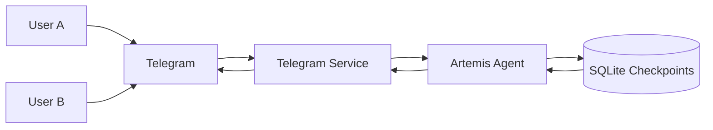

# **Chapter 6 — Integrating Artemis with Telegram (Multi-User Agents in the Real World)**

Until now, Artemis lived in controlled environments:

- A local UI
- A single user
- Short-lived sessions

That’s useful for learning—but not how assistants are used in real life.

In this chapter, we integrate Artemis with **Telegram**, turning it into a **real, always-on, multi-user AI agent**.

We will cover:

- Creating a Telegram bot using **BotFather**
- Installing required dependencies
- Wiring Artemis to Telegram
- Handling **multiple users and chats safely**
- Mapping Telegram chats to agent memory (`thread_id`)

This is where Artemis stops being a demo
and starts behaving like a real system.

---

## **Why Telegram Is a Great First Integration**

Telegram provides exactly what an agent system needs:

- Text-first interface (perfect for LLMs)
- Built-in user and chat identifiers
- Long-running bot processes
- No UI maintenance
- Natural multi-user environment

Most importantly:

> **Telegram forces you to design memory and identity correctly.**

---

## **Step 1 — Creating a Telegram Bot (BotFather)**

Telegram bots are managed by a special bot called **BotFather**.

### **Steps**

1. Open Telegram
2. Search for **BotFather**
3. Start a chat
4. Run:

   ```
   /start
   ```

5. Create a new bot:

   ```
   /newbot
   ```

6. Choose:

   - A display name
   - A username (must end with `bot`)

BotFather will return a **Bot Token**.

This token uniquely identifies your bot.

---

## **Step 2 — Store the Telegram API Key**

Create a `.env` file at the project root:

```env
TELEGRAM_API_KEY=your_bot_token_here
```

Artemis loads this value via configuration.

### **`backend/config/__init__.py`**

```python
from typing import Literal
from os import environ


class ArtemisConfig:
    llm_provider: Literal["openrouter", "openai"]
    llm_model: str
    max_conversation_token_limit: int
    telegram_api_key: str

    def __init__(self):
        self.llm_provider = environ.get("LLM_PROVIDER", "openrouter")
        self.llm_model = environ.get("LLM_MODEL_NAME", "x-ai/grok-4-fast")
        self.max_conversation_token_limit = environ.get(
            "MAX_CONVERSATION_TOKEN_LIMIT", 10240
        )
        self.telegram_api_key = environ.get("TELEGRAM_API_KEY")


settings = ArtemisConfig()
```

This keeps secrets:

- Out of source control
- Centralized
- Easy to rotate

---

## **Step 3 — Install Telegram Dependencies**

Artemis uses `python-telegram-bot`.

Using **uv**:

```bash
uv add python-telegram-bot
```

---

## **Step 4 — Telegram Service Layer**

Telegram integration lives in a **dedicated service module**.

### **`backend/services/telegram.py`**

```python
from typing import Callable, Optional
from backend.config import settings

from telegram import Update
from telegram.ext import (
    ApplicationBuilder,
    CommandHandler,
    ContextTypes,
    Application,
    MessageHandler,
)
```

This layer is responsible only for:

- Receiving messages from Telegram
- Extracting user/chat identity
- Passing messages to the agent
- Sending responses back

It does **not** contain any agent logic.

---

## **Initializing the Telegram App**

```python
class Telegram:
    app: Application
    handle_message: Callable[[str, int], str]

    def __init__(
        self,
        on_message: Optional[Callable[[str, int], str]] = None,
    ):
        self.app = ApplicationBuilder().token(
            settings.telegram_api_key
        ).build()
```

Here:

- The bot authenticates using the API key
- Telegram’s polling loop is prepared

---

## **Handling Commands (`/start`)**

```python
self.app.add_handler(CommandHandler("start", self.hello))
```

```python
async def hello(
    self,
    update: Update,
    context: ContextTypes.DEFAULT_TYPE
) -> None:
    await update.message.reply_text(
        f"Hello {update.effective_user.first_name}"
    )
```

This is optional, but improves first-time user experience.

---

## **Handling User Messages**

```python
self.app.add_handler(
    MessageHandler(None, self.message_handler, True)
)
```

```python
async def message_handler(
    self,
    update: Update,
    context: ContextTypes.DEFAULT_TYPE
):
    thread_id = update.effective_chat.id
    user_text = update.message.text

    ai_response = self.handle_message(user_text, thread_id)

    await update.message.reply_text(ai_response)
```

This is the **most important part**.

---

## **Understanding `thread_id` in Telegram**

Telegram provides:

- `update.effective_chat.id`

This ID uniquely identifies:

- A private chat
- A group chat
- A channel conversation

Artemis uses this value as the **conversation key**.

---

## **Why This Enables Multi-User Support**

Each Telegram chat maps to a unique memory thread:

```text
Chat ID → Agent thread_id → SQLite checkpoint
```

This guarantees:

- User A never sees User B’s memory
- Group chats share context correctly
- Conversations persist across restarts

---

## **Message Handling Inside the Agent**

### **`backend/agent/message_handler.py`**

```python
from langchain.messages import HumanMessage
from typing import Any


def handle_message(agent: Any, last_message: str, user_id: int):
    request = [HumanMessage(last_message)]

    response = agent.invoke(
        {"messages": request},
        {"configurable": {"thread_id": str(user_id)}}
    )

    return response["messages"][-1].content
```

Notice:

- Only the new message is sent
- Full history is loaded from SQLite
- Context trimming happens automatically

The UI does **not** manage memory.

---

## **Step 5 — Wiring Everything Together**

### **`backend/main.py`**

```python
from load_dotenv import load_dotenv
load_dotenv()

from backend.agent.message_handler import handle_message
from backend.agent import build_agent
from backend.services.telegram import Telegram
from langgraph.checkpoint.sqlite import SqliteSaver
```

```python
if __name__ == "__main__":

    with SqliteSaver.from_conn_string("./db/short_memory.db") as checkpointer:
        agent = build_agent(checkpointer)

        telegram = Telegram(
            on_message=lambda prompt, thread_id:
                handle_message(agent, prompt, thread_id)
        )

        telegram.start()
```

At runtime:

- Artemis loads persisted memory
- Starts a Telegram polling loop
- Handles messages from multiple users concurrently

---

## **Running the Bot**

Run Artemis as a module:

```bash
python -m backend.main
```

You should see:

```
Telegram ai bot is running!
```

Send a message to your bot on Telegram—it will respond immediately.

---

## **Multi-User Architecture (Conceptual)**



One agent instance.
Many users.
Isolated memory.

---

## **What We’ve Achieved**

By the end of this chapter, Artemis:

- Runs as a Telegram bot
- Handles multiple users safely
- Persists memory per chat
- Respects context window limits
- Reuses the same agent logic everywhere

This is a **huge architectural milestone**.

---

## **Key Takeaways**

- Telegram forces correct identity handling
- `thread_id` is the foundation of multi-user agents
- Transport layers must stay stateless
- Memory belongs to the agent, not the UI
- The same agent can power many interfaces

---

## **What’s Next**

Now that Artemis operates in the real world, a harder problem emerges:

> Not every message deserves to be remembered.

In the next chapter, we’ll explore:

- What to remember vs what to forget
- Short-term vs long-term memory
- Structured user facts
- Retrieval-based memory instead of replay

This is where Artemis stops being _chatty_
and starts being **intelligent**.
