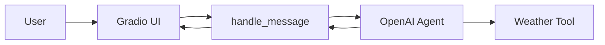

# **Chapter 2 — Building an Agent and Wiring It to a UI**

In Chapter 1, we learned how to:

- Talk to an LLM using an API
- Structure messages
- Enable tool calling
- Build a request → tool → response loop

Now it’s time to **organize that logic into a real system**.

In this chapter, we will walk through the **actual implementation** used in Artemis:

- How `openai_agent.py` defines the agent
- How tools are registered
- How conversation history is reconstructed
- How the agent is connected to a Gradio UI

No pseudocode.
No theory-only diagrams.
Only what exists in this repository.

---

## **Current Backend Structure**

Let’s first look at the relevant backend layout:

```
backend/
├── agent/
│   └── openai_agent.py
├── tools/
│   └── weather.py
├── main.py
```

Each directory has a single responsibility:

- `tools/` → external capabilities
- `agent/` → LLM orchestration
- `main.py` → user interface (Gradio)

This separation is intentional.

---

## **Why an Agent File Exists**

Instead of calling the LLM directly from the UI, Artemis introduces an **agent layer**.

The agent is responsible for:

- Model selection
- Tool registration
- Prompt configuration
- Message formatting
- Invocation and response handling

The UI does **none** of this.

This keeps:

- The UI simple
- The agent reusable
- The system extensible

---

## **Defining a Tool**

Let’s start with the simplest component: a tool.

### **`backend/tools/weather.py`**

```python
from langchain.tools import tool
import random


@tool
def get_weather(city: str) -> int:
    """Return weather for given city in celsius"""
    return random.randint(20, 50)
```

Key observations:

1. The tool is a **normal Python function**
2. The `@tool` decorator makes it discoverable by the agent
3. The function signature becomes the **input schema**
4. The docstring becomes the **tool description**

The LLM never executes this function.
It only decides **when** it should be called.

---

## **Creating the Agent**

The agent lives in:

```
backend/agent/openai_agent.py
```

### **Agent Construction**

```python
from langchain.agents import create_agent
from tools.weather import get_weather


def get_openai_agent():
    agent = create_agent(
        "gpt-4.1",
        tools=[get_weather],
        system_prompt="You are a helpful assistant",
    )
    return agent
```

This function defines the **entire reasoning unit**.

What happens here?

- `"gpt-4.1"` → model selection
- `tools=[get_weather]` → tool registration
- `system_prompt` → behavioral baseline

This single function fully defines:

> _What the agent is capable of_

---

## **Why the Agent Is Created Per Request**

You might notice that the agent is created **inside** the request handler.

This means:

- No shared global state
- No hidden memory
- Every request is deterministic

This is a good design choice early on.

Memory will be introduced explicitly in later chapters.

---

## **Handling Messages from the UI**

Gradio provides conversation history in a **UI-specific format**.

The agent, however, expects **LangChain message objects**.

This translation happens inside `handle_message`.

### **`handle_message` Function**

```python
from langchain.messages import HumanMessage, AIMessage
from typing import List


def handle_message(last_message: str, history: List):
    agent = get_openai_agent()
    request = []
```

At this point:

- `last_message` → latest user input
- `history` → full conversation from Gradio

---

## **Reconstructing Conversation History**

```python
    for message in history:
        if message["role"] == "assistant":
            request.append(AIMessage(message["content"][0]["text"]))
        else:
            request.append(HumanMessage(message["content"][0]["text"]))
```

This step is critical.

Gradio stores messages like:

```json
{
  "role": "assistant",
  "content": [{ "text": "Hello!" }]
}
```

LangChain expects:

- `HumanMessage`
- `AIMessage`

So we **replay the entire conversation**, converting UI messages into LLM messages.

This makes the model feel _stateful_ even though it isn’t.

---

## **Appending the Latest User Message**

```python
    request.append(HumanMessage(last_message))
```

Now the message list represents:

- Full conversation so far
- Latest user input at the end

This mirrors how chat-completion APIs work internally.

---

## **Invoking the Agent**

```python
    response = agent.invoke({"messages": request})
```

At this point:

- The agent decides whether a tool is needed
- The tool may be executed internally
- The agent produces a final response

All of that happens **inside the agent abstraction**.

The UI does not know — and should not care.

---

## **Returning the Final Answer**

```python
    return response["messages"][-1].content
```

The agent returns a list of messages.
We only care about:

- The **last assistant message**
- The final user-facing output

That’s all the UI needs.

---

## **Connecting the Agent to Gradio**

Now let’s see how this logic is exposed to the user.

### **`backend/main.py`**

```python
from load_dotenv import load_dotenv
import gradio as gr

from agent.openai_agent import handle_message

load_dotenv()
```

Environment variables (like API keys) are loaded here.

---

### **Launching the Chat Interface**

```python
if __name__ == "__main__":
    gr.ChatInterface(
        fn=handle_message,
    ).launch()
```

This is intentionally minimal.

Gradio:

- Takes user input
- Passes it to `handle_message`
- Displays whatever comes back

No prompts.
No tools.
No agent logic.

---

## **End-to-End Flow**

Here’s what happens when a user types a message:

1. User types into Gradio UI
2. Gradio calls `handle_message`
3. Agent is created
4. History is reconstructed
5. Agent invokes the LLM
6. Tool may be called
7. Final response is returned
8. UI displays the result



This clean separation is what makes Artemis easy to extend.

---

## **Why This Design Works**

- UI stays dumb
- Agent owns reasoning
- Tools are explicit
- Memory is not implicit
- Control flow is visible

Nothing magical is happening.

That’s the goal.

---

## **Key Takeaways**

- The agent is an orchestration layer, not a chatbot
- Tools are just Python functions with contracts
- Conversation state is replayed, not stored
- Gradio is only a transport layer
- Clean boundaries make agent systems scalable

---

## **What’s Next**

In the next chapter, we will explore:

- Why replaying _all_ history eventually breaks
- Token limits and context windows
- Short-term vs long-term memory
- How to store memory intentionally

This is where Artemis starts to **remember — instead of repeating**.
