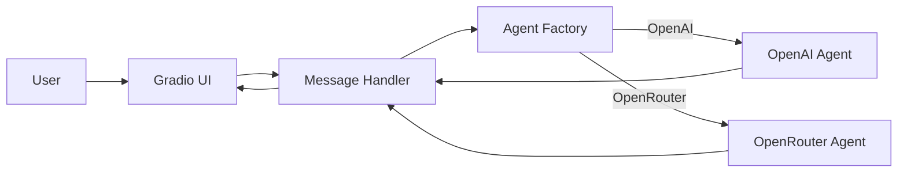

# **Chapter 3 — Supporting Multiple LLM Backends**

Up until now, Artemis has behaved like a single-model system.
But real-world agentic systems rarely stay that way.

Different models have different strengths:

- Some are cheaper
- Some are faster
- Some are better at reasoning
- Some are hosted by different providers

In this chapter, we will evolve Artemis from a **single-backend agent** into a **multi-LLM system** that can switch providers without changing UI or agent logic.

We will cover:

- Adding OpenRouter as an LLM backend
- Supporting multiple LLM providers cleanly
- Introducing a configuration layer
- Using **relative imports** correctly
- Running the project as a module using `python -m`

---

## **Why Multiple LLM Backends Matter**

Hardcoding a single model or provider creates tight coupling:

- UI depends on the model
- Agent depends on the provider
- Switching models requires code changes everywhere

Instead, Artemis adopts a simple rule:

> **The rest of the system should not care which LLM is being used.**

This is a foundational principle for scalable agent systems.

---

## **Introducing a Configuration Layer**

The first step is introducing a central configuration object.

### **`backend/config/__init__.py`**

```python
from typing import Literal
from os import environ


class ArtemisConfig:
    llm_provider: Literal["openrouter", "openai"]

    def __init__(self):
        self.llm_provider = environ.get("LLM_PROVIDER", "openrouter")
```

Key ideas:

- Configuration is environment-driven
- Defaults are explicit
- No hardcoded provider logic elsewhere

Now the backend can switch LLM providers **without touching application code**.

---

## **Agent Selection Based on Configuration**

Instead of constructing an agent directly, Artemis introduces a **factory function**.

### **`backend/agent/__init__.py`**

```python
from backend.config import ArtemisConfig
from .openai_agent import get_openai_agent
from .openrouter_agent import get_openrouter_agent
from backend.tools.weather import get_weather


def get_agent():
    config = ArtemisConfig()
    tools = [get_weather]

    if config.llm_provider == "openai":
        return get_openai_agent(tools)

    return get_openrouter_agent(tools)
```

This file becomes the **single decision point** for:

- Which provider to use
- Which tools are registered

The rest of the system never asks _how_ the agent is created.

---

## **OpenAI Agent Implementation**

The OpenAI-backed agent is intentionally minimal.

### **`backend/agent/openai_agent.py`**

```python
from langchain.agents import create_agent
from langchain.tools import BaseTool
from typing import Sequence


def get_openai_agent(tools: Sequence[BaseTool]):
    agent = create_agent(
        "gpt-4.1",
        tools=tools,
        system_prompt="You are a helpful assistant",
    )
    return agent
```

This version:

- Uses a model name directly
- Relies on default OpenAI configuration
- Keeps provider-specific logic isolated

---

## **Adding OpenRouter as a Backend**

OpenRouter allows you to route requests to multiple models using a single API.

To support it, Artemis introduces a **provider-specific agent builder**.

### **`backend/agent/openrouter_agent.py`**

```python
from langchain.agents import create_agent
from langchain_openai import ChatOpenAI
from langchain.tools import BaseTool
from typing import Sequence
import os


def get_openrouter_agent(
    tools: Sequence[BaseTool],
    model: str = "x-ai/grok-4-fast",
):
    llm = ChatOpenAI(
        model=model,
        api_key=os.environ.get("OPENAI_API_KEY"),
        base_url="https://openrouter.ai/api/v1/",
    )

    agent = create_agent(
        llm,
        tools=tools,
        system_prompt="You are a helpful assistant",
    )
    return agent
```

Important observations:

- OpenRouter uses the same OpenAI-compatible interface
- Only `base_url` and model name differ
- The agent interface remains identical

This confirms an important design insight:

> **Agents depend on behavior, not providers.**

---

## **Separating Message Handling from Agent Creation**

Previously, agent logic and message handling lived together.

Now Artemis introduces a dedicated message handler.

### **`backend/agent/message_handler.py`**

```python
from langchain.messages import HumanMessage, AIMessage
from typing import List, Any


def handle_message(agent: Any, last_message: str, history: List):
    request = []

    for message in history:
        if message["role"] == "assistant":
            request.append(AIMessage(message["content"][0]["text"]))
        else:
            request.append(HumanMessage(message["content"][0]["text"]))

    request.append(HumanMessage(last_message))
    response = agent.invoke({"messages": request})

    return response["messages"][-1].content
```

Now responsibilities are clear:

- Agent creation → `get_agent`
- Conversation reconstruction → `handle_message`
- UI wiring → `main.py`

This separation will become critical once memory and routing are added.

---

## **Why Relative Imports Matter**

Notice how imports are written:

```python
from backend.agent.message_handler import handle_message
from backend.agent import get_agent
```

This only works correctly when the project is run as a **module**, not a script.

Which leads us to an important execution detail.

---

## **Running the Project Correctly**

Instead of:

```bash
python backend/main.py
```

Artemis should now be run as:

```bash
python -m backend.main
```

Why?

Because:

- Python resolves `backend` as a package
- Relative imports work correctly
- The project behaves like an installable application

This is a **best practice** for non-trivial Python systems.

---

## **Updated Entry Point**

### **`backend/main.py`**

```python
from load_dotenv import load_dotenv
import gradio as gr

from backend.agent.message_handler import handle_message
from backend.agent import get_agent

load_dotenv()

if __name__ == "__main__":
    gr.ChatInterface(
        fn=lambda prompt, history: handle_message(get_agent(), prompt, history),
        title="Artemis AI",
    ).launch()
```

The UI:

- Does not know which LLM is used
- Does not know which tools exist
- Simply delegates to the agent

This is intentional and scalable.

---

## **End-to-End Flow (Now with Multiple Backends)**



The system is now **provider-agnostic**.

---

## **Key Takeaways**

- Multi-LLM support starts with configuration
- Agent creation must be centralized
- Provider-specific logic must stay isolated
- Message handling should be reusable
- Running as a module enables clean imports

---

## **What’s Next**

In the next chapter, we’ll tackle:

- Why replaying full history breaks at scale
- Context window limits
- Short-term vs long-term memory
- How to introduce memory _without_ breaking agent purity

This is where Artemis becomes **persistent**.
