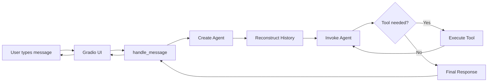

# Connecting to Gradio

Now let's see how the agent connects to a real user interface.

## The Entry Point

`backend/main.py` is intentionally minimal:

```python
from load_dotenv import load_dotenv
import gradio as gr

from agent.openai_agent import handle_message

load_dotenv()

if __name__ == "__main__":
    gr.ChatInterface(
        fn=handle_message,
    ).launch()
```

That's it. The entire UI in ~10 lines.

## What Each Part Does

### Environment Variables

```python
from load_dotenv import load_dotenv
load_dotenv()
```

Loads API keys and configuration from `.env`.

### The Chat Interface

```python
gr.ChatInterface(
    fn=handle_message,
).launch()
```

Gradio's `ChatInterface`:

- Provides a chat UI
- Collects user input
- Tracks conversation history
- Calls `handle_message` with each message
- Displays the response

### The Connection

```python
fn=handle_message
```

This single line connects UI to agent:

- User types a message
- Gradio calls `handle_message(message, history)`
- Agent processes and returns a response
- Gradio displays it

## What Gradio Handles

| Feature | Automatic |
|---------|-----------|
| Chat UI layout | Yes |
| Message history | Yes |
| User input | Yes |
| Submit button | Yes |
| Response display | Yes |
| Scroll behavior | Yes |

You don't build any of this.

## What Gradio Doesn't Know

- Which LLM is being used
- What tools exist
- How prompts are formatted
- Whether tools were called

The UI is intentionally "dumb."

## End-to-End Flow

Here's what happens when a user sends a message:



1. User types into Gradio UI
2. Gradio calls `handle_message`
3. Agent is created
4. History is reconstructed
5. Agent invokes the LLM
6. Tool may be called
7. Final response is returned
8. UI displays the result

## Why This Design Works

| Principle | Implementation |
|-----------|----------------|
| UI stays dumb | Only collects input, displays output |
| Agent owns reasoning | All LLM logic in one place |
| Tools are explicit | Defined and registered separately |
| Memory is not implicit | No hidden state |
| Control flow is visible | Easy to trace and debug |

Nothing magical is happening. That's the goal.

---

## Chapter Summary

In this chapter, you learned:

- An agent layer separates UI from LLM logic
- Tools are decorated Python functions
- Agents are created with model, tools, and prompt
- Message handling converts between UI and LLM formats
- Gradio provides a minimal chat interface

This architecture makes Artemis easy to extend, test, and maintain.

---

## What's Next

At this point, Artemis is a **cleanly structured agent system**:

- The UI is decoupled from reasoning
- The agent owns control flow
- Tools are explicit and safe
- Conversation state is reconstructed deterministically

However, there's still a hidden assumption:

> The agent is tied to a single LLM backend.

Real-world systems don't work this way.

In the next chapter, we'll evolve Artemis beyond a single provider by:

- Introducing a configuration layer
- Supporting multiple LLM backends
- Adding OpenRouter alongside OpenAI
- Running the project as a proper Python module

**Continue to:** [Multi-Backend Support](/multi-backend-support)
