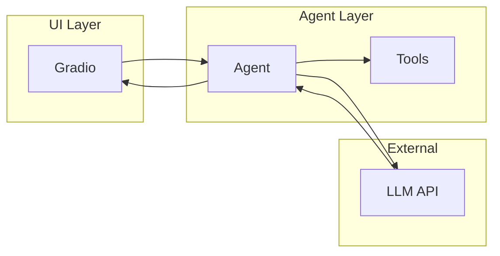

# Why an Agent Layer?

Instead of calling the LLM directly from the UI, Artemis introduces an **agent layer**.

## The Problem with Direct Calls

If the UI calls the LLM directly:

```
UI → LLM API → Response
```

Everything gets tangled:

- Model selection lives in the UI
- Tool definitions live in the UI
- Prompt configuration lives in the UI
- The UI becomes complex and hard to test

## The Agent Solution

An agent layer creates a clean boundary:

```
UI → Agent → LLM API → Response
         ↓
       Tools
```

The agent is responsible for:

| Responsibility | Description |
|----------------|-------------|
| Model selection | Which LLM to use |
| Tool registration | What capabilities exist |
| Prompt configuration | System prompts and behavior |
| Message formatting | Converting UI format to LLM format |
| Response handling | Parsing and returning results |

The UI does **none** of this.

## Benefits of Separation

### 1. Simple UI

The UI only needs to:

- Collect user input
- Display responses
- Show chat history

It doesn't know about models, tools, or prompts.

### 2. Reusable Agent

The same agent can power:

- A web interface (Gradio)
- A CLI tool
- A Telegram bot
- An API endpoint

No changes needed.

### 3. Testable Logic

You can test the agent without a UI:

```python
response = agent.invoke({"messages": test_messages})
assert "weather" in response["messages"][-1].content
```

### 4. Extensible Design

Adding a new tool or changing the model happens in one place:

```python
# agent/openai_agent.py
agent = create_agent(
    "gpt-4.1",
    tools=[get_weather, search_web],  # Add new tools here
    system_prompt="...",
)
```

## The Clean Boundary



The UI only talks to the agent. The agent handles everything else.

---

## Key Takeaways

- An agent layer separates concerns
- The UI stays simple and focused
- The agent owns all LLM-related logic
- This design enables reusability and testing

---

**Next:** [Defining Tools](/building-agents/defining-tools)
