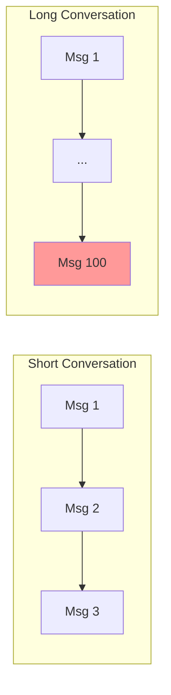

# The Context Window Problem

Every LLM has a **context window** — the maximum number of tokens it can see at once.

## What Happens When You Hit the Limit

If you blindly keep appending messages:

| Issue | Impact |
|-------|--------|
| **Expensive prompts** | You pay for all those tokens |
| **Increased latency** | More tokens = slower responses |
| **Request rejection** | Model refuses requests that exceed limits |

Eventually, the model will **reject your request** entirely.

## Context Window Sizes

Different models have different limits:

| Model | Context Window |
|-------|---------------|
| GPT-3.5 Turbo | ~4,000 - 16,000 tokens |
| GPT-4 | ~8,000 - 128,000 tokens |
| Claude 3 | ~200,000 tokens |
| Local models | Varies widely |

Even 200,000 tokens has limits. A long conversation can easily exceed it.

## The Math Problem

Consider this scenario:

- Average message: 50 tokens
- System prompt: 200 tokens
- Context window: 8,000 tokens

```
Available for history: 8,000 - 200 = 7,800 tokens
Messages that fit: 7,800 / 50 = 156 messages
```

After 156 messages, you're out of space.

And this assumes short messages. Technical discussions or code can easily use 500+ tokens per message.

## The Scaling Problem



Short conversations work fine. Long conversations break.

## The Solution: Controlled Memory

To build a real assistant, we need **controlled memory**, not infinite memory:

1. **Limit what's stored** — Not every message matters
2. **Trim old messages** — Remove less relevant history
3. **Summarize** — Compress long conversations (advanced)
4. **Be intentional** — Memory is a design decision

The rule is universal:

> **Unbounded history breaks agent systems.**

---

## Key Takeaways

- Every LLM has a context window limit
- Unlimited history breaks at scale
- You must actively manage what's in context
- Memory must be intentional and bounded

---

**Next:** [Thread-Based Memory](/memory-management/thread-based-memory)
