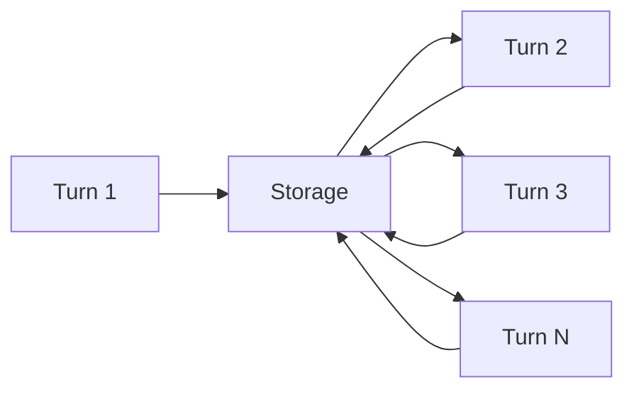

# LLM Statelessness

The most important thing to understand about LLMs:

> **They don't remember anything.**

## How We Handled Memory So Far

In previous chapters, Artemis handled conversation continuity by:

```python
def handle_message(last_message, history):
    request = []
    
    # Replay entire history
    for message in history:
        request.append(convert_to_llm_format(message))
    
    # Add new message
    request.append(HumanMessage(last_message))
    
    return agent.invoke({"messages": request})
```

Every message ever exchanged is sent again with each new request.

## Why This Worked (Initially)

This approach worked because:

- Conversations were short
- Token usage was low
- We were manually controlling message replay

It's the simplest form of "memory" — just send everything.

## The Illusion of Memory

When you chat with an LLM and it "remembers" your name:

```
User: My name is Alice.
Assistant: Nice to meet you, Alice!
User: What's my name?
Assistant: Your name is Alice.
```

The LLM isn't remembering. It sees this:

```json
[
  {"role": "user", "content": "My name is Alice."},
  {"role": "assistant", "content": "Nice to meet you, Alice!"},
  {"role": "user", "content": "What's my name?"}
]
```

Your name is in the input. The model just reads it.

## The Real Memory Rule

The only way an LLM can "remember" something is if we **send that information again** as part of the prompt.



Memory is:

1. **Storage** — Keep messages somewhere
2. **Retrieval** — Include relevant messages in each request
3. **Management** — Decide what to keep and what to discard

## Different Types of Memory

| Type | Description | Example |
|------|-------------|---------|
| **Short-term** | Recent conversation turns | "What did I just say?" |
| **Long-term** | Facts that persist | "User prefers dark mode" |
| **Episodic** | Past conversation summaries | "Last week we discussed..." |

This chapter focuses on **short-term memory** — keeping recent conversation in context.

---

## Key Takeaways

- LLMs are stateless by design
- "Memory" is just including past messages in the prompt
- Someone has to store and manage those messages
- Different types of memory serve different purposes

---

**Next:** [The Context Window Problem](/memory-management/context-window-problem)
