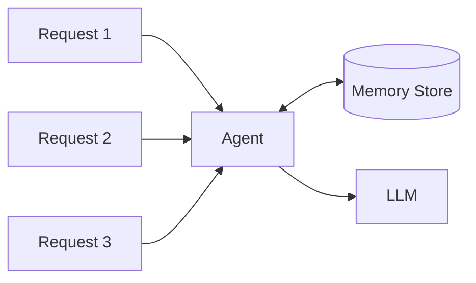

# Memory Storage

Where does the conversation history actually live?

## The Memory Saver

Memory storage is defined in a dedicated module.

`backend/memory/storage.py`:

```python
from langgraph.checkpoint.memory import InMemorySaver


def get_memory_saver():
    return InMemorySaver()  # In-memory for now
```

## Storage Options

| Storage | Persistence | Use Case |
|---------|-------------|----------|
| `InMemorySaver` | None (lost on restart) | Development, testing |
| `SqliteSaver` | File-based | Production, single instance |
| `PostgresSaver` | Database | Production, distributed |
| `RedisSaver` | Cache | High-performance, ephemeral |

Currently, memory lives in RAM and resets when the app restarts.

:::info Intentional Choice
This is intentional for learning. Later chapters will upgrade to persistent storage (SQLite).
:::

## Wiring Memory to the Agent

The memory saver is passed to the agent during creation:

```python
agent = create_agent(
    llm,
    tools=tools,
    system_prompt="You are a helpful assistant",
    checkpointer=settings.checkpointer,  # Memory storage
)
```

The `checkpointer` parameter tells the agent where to store conversation state.

## Why a Global Config Object?

Memory should **not** be recreated on every request:

```python
# backend/config/__init__.py
settings = ArtemisConfig()  # Global instance
```

This ensures:

| Benefit | Description |
|---------|-------------|
| **One memory store** | Single source of truth |
| **Consistent state** | All requests see same history |
| **Predictable behavior** | No surprising resets |

If you recreate the config each request, you get a fresh (empty) memory each time.

## How Memory Flows



Multiple requests share the same memory store, accessed via thread IDs.

## Testing Memory

To verify memory is working:

```python
# Turn 1
response1 = handle_message(agent, "My name is Alice", "test-thread")
# "Nice to meet you, Alice!"

# Turn 2
response2 = handle_message(agent, "What's my name?", "test-thread")
# "Your name is Alice."

# Different thread
response3 = handle_message(agent, "What's my name?", "other-thread")
# "I don't know your name yet."
```

Same thread remembers. Different thread doesn't.

---

## Key Takeaways

- Memory storage is a separate, configurable component
- Multiple storage backends are available
- A global config ensures consistent memory access
- Memory is isolated by thread ID

---

**Next:** [Trimming Middleware](/memory-management/trimming-middleware)
