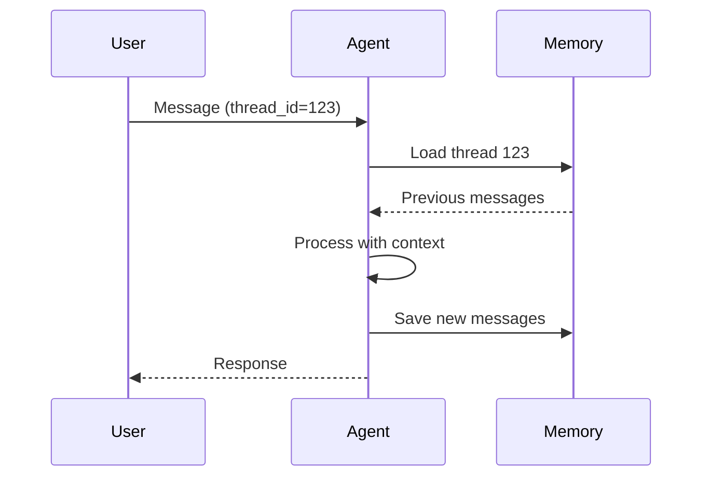

# Thread-Based Memory

Instead of manually reconstructing the entire dialog every time, Artemis now uses **thread-based conversations**.

## The Thread Concept

A `thread_id` represents a **conversation session**:

```python
thread_id = "1"  # Hardcoded for simplicity
```

In real systems, this could be:

| Use Case | Thread ID Source |
|----------|------------------|
| Web app | Session ID |
| Mobile app | Device ID |
| Telegram | Chat ID |
| Multi-user | User ID + context |

## How Thread IDs Work



Each thread has its own isolated history.

## The Updated Message Handler

`backend/agent/message_handler.py`:

```python
def handle_message(agent: Any, last_message: str, user_id: str):
    request = [HumanMessage(last_message)]

    response = agent.invoke(
        {"messages": request},
        {"configurable": {"thread_id": user_id}}
    )

    return response["messages"][-1].content
```

## Key Changes

### Before (Manual Replay)

```python
# Build full history manually
request = []
for message in history:
    request.append(convert(message))
request.append(HumanMessage(last_message))
```

### After (Agent-Managed)

```python
# Just send the new message
request = [HumanMessage(last_message)]

# Agent handles history internally
response = agent.invoke(
    {"messages": request},
    {"configurable": {"thread_id": user_id}}  # Memory key
)
```

## What Changed

| Aspect | Before | After |
|--------|--------|-------|
| History management | Manual in UI | Agent handles it |
| Thread isolation | None | Per thread_id |
| Scalability | Limited | Much better |
| Code complexity | Higher | Lower |

## Benefits

1. **Simpler handler** — Just pass the new message
2. **Thread isolation** — Users don't see each other's history
3. **Agent ownership** — Memory is the agent's responsibility
4. **Scalability** — Works for many concurrent users

---

## Key Takeaways

- Thread IDs identify conversation sessions
- The agent manages history internally
- You only pass the new message and thread ID
- Different threads have isolated memory

---

**Next:** [Memory Storage](/memory-management/memory-storage)
