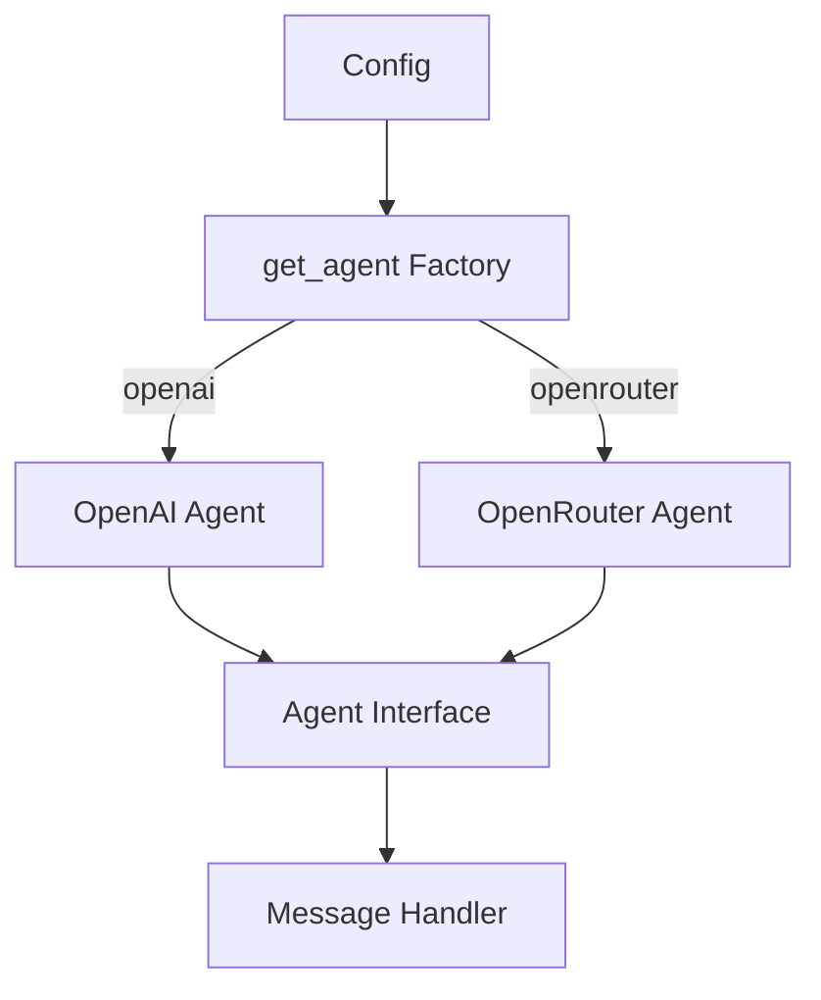

# Agent Factory Pattern

Instead of constructing an agent directly, Artemis uses a **factory function** that chooses the right implementation based on configuration.

## The Factory Function

`backend/agent/__init__.py`:

```python
from backend.config import ArtemisConfig
from .openai_agent import get_openai_agent
from .openrouter_agent import get_openrouter_agent
from backend.tools.weather import get_weather


def get_agent():
    config = ArtemisConfig()
    tools = [get_weather]

    if config.llm_provider == "openai":
        return get_openai_agent(tools)

    return get_openrouter_agent(tools)
```

## What This Achieves

This single file becomes the **decision point** for:

| Decision | Location |
|----------|----------|
| Which provider | `get_agent()` |
| Which tools | `get_agent()` |
| Which model | Provider-specific functions |

The rest of the system never asks *how* the agent is created.

## The Pattern Visualized



All agents expose the same interface. The handler doesn't know or care which one it's using.

## Benefits of the Factory Pattern

### 1. Single Point of Change

Adding a new provider:

```python
def get_agent():
    config = ArtemisConfig()
    tools = [get_weather]

    if config.llm_provider == "openai":
        return get_openai_agent(tools)
    elif config.llm_provider == "anthropic":
        return get_anthropic_agent(tools)  # New!
    
    return get_openrouter_agent(tools)
```

### 2. Consistent Tool Registration

All providers get the same tools:

```python
tools = [get_weather, search_web, calculate]
```

### 3. Testability

For testing, add a mock provider:

```python
if config.llm_provider == "mock":
    return get_mock_agent(tools)
```

## Tools Are Registered Here

Notice that tools are defined in the factory:

```python
tools = [get_weather]
```

This means:

- All agents have the same capabilities
- Adding tools happens in one place
- No tool imports scattered around

---

## Key Takeaways

- Factory functions centralize agent creation
- Configuration drives provider selection
- The rest of the system uses a consistent interface
- Tools are registered in one location

---

**Next:** [Adding OpenRouter](/multi-backend-support/adding-openrouter)
