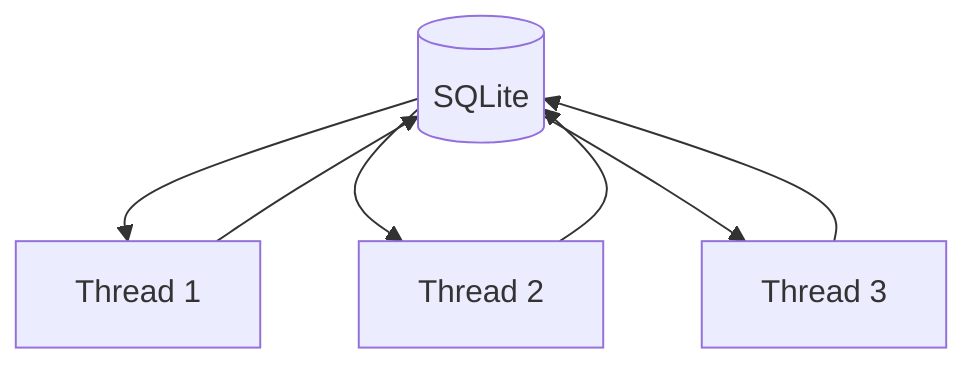

# SQLite Checkpointing

The most important change in this chapter is moving from in-memory to SQLite-based storage.

## The Implementation

`backend/main.py`:

```python
from langgraph.checkpoint.sqlite import SqliteSaver

thread_id = "1"  # Hardcoded for simplicity

with SqliteSaver.from_conn_string("./db/short_memory.db") as checkpointer:
    agent = build_agent(checkpointer)
```

## What This Gives You

| Benefit | Description |
|---------|-------------|
| **Survives restarts** | State persists in file |
| **Inspectable** | Open with any SQLite tool |
| **Reliable** | Multi-turn flows work consistently |
| **No infrastructure** | Just a file on disk |

## The Context Manager

Notice the `with` statement:

```python
with SqliteSaver.from_conn_string("./db/short_memory.db") as checkpointer:
    # Use checkpointer
    ...
```

This ensures:

1. Database connection is properly opened
2. Changes are saved on exit
3. Connection is closed cleanly

## File Location

```
./db/short_memory.db
```

Create the directory if it doesn't exist:

```bash
mkdir -p db
```

The `.db` file contains all conversation history, structured by `thread_id`.

## Thread ID Mapping

Each `thread_id` represents a single conversation timeline:



Later, these naturally map to:

- User IDs
- Session IDs
- Chat IDs (Telegram)

## Why thread_id Is Explicit

Checkpointing only works if the agent knows *which* state to load:

```python
response = agent.invoke(
    {"messages": request},
    {"configurable": {"thread_id": user_id}}  # Must provide this
)
```

This makes conversation ownership explicit and avoids hidden global state.

## What Disappeared

Once checkpointing is enabled, you no longer need:

- Manual history replay
- UI-side conversation storage
- Role conversion logic

> **The agent owns memory.**

The UI sends only the new user message. Everything else is recovered automatically.

---

## Key Takeaways

- SQLite provides simple, file-based persistence
- Use context managers for proper cleanup
- Thread IDs identify which conversation to load
- The agent handles history internally

---

**Next:** [Token-Aware Trimming](/persistence/token-aware-trimming)
