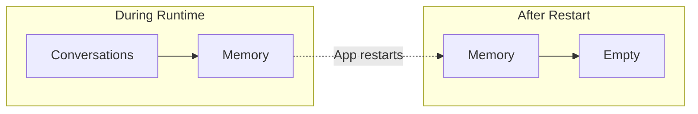

# Why Persistence?

Before this refactor, conversation state lived only in memory.

## The Problem with In-Memory State



Every time you restart the app:

- All conversations are lost
- Users start from scratch
- No continuity

## Real-World Scenarios

### Scenario 1: Deployment Update

You deploy a new version of Artemis:

```bash
# Stop old version
kill $PID

# Start new version
python -m backend.main
```

With in-memory storage: **All conversations gone.**

### Scenario 2: Server Crash

The server crashes at 3 AM:

- Memory is lost
- Users wake up to a fresh (empty) assistant
- No record of previous interactions

### Scenario 3: Debugging

A user reports a bug:

> "The assistant gave me wrong information yesterday."

With in-memory storage: **No way to investigate.**

## What Persistence Enables

| Capability | Description |
|------------|-------------|
| **Survival** | State survives restarts |
| **Debugging** | Inspect past conversations |
| **Reliability** | Consistent multi-turn flows |
| **Accountability** | Audit trail of interactions |

## The Solution: Checkpointing

Checkpointing means saving agent state to disk:

```
Agent State → SQLite File → Survives Restart
```

Each conversation (identified by `thread_id`) is saved independently.

## Why SQLite?

SQLite is ideal for this stage:

| Feature | Benefit |
|---------|---------|
| File-based | No database server needed |
| Simple | Single file, easy backup |
| Reliable | ACID transactions |
| Fast enough | Good for local/early production |

Later, you can upgrade to PostgreSQL for distributed systems.

---

## Key Takeaways

- In-memory state is lost on restart
- Real applications need persistent storage
- Checkpointing saves agent state to disk
- SQLite is a good starting point

---

**Next:** [SQLite Checkpointing](/persistence/sqlite-checkpointing)
