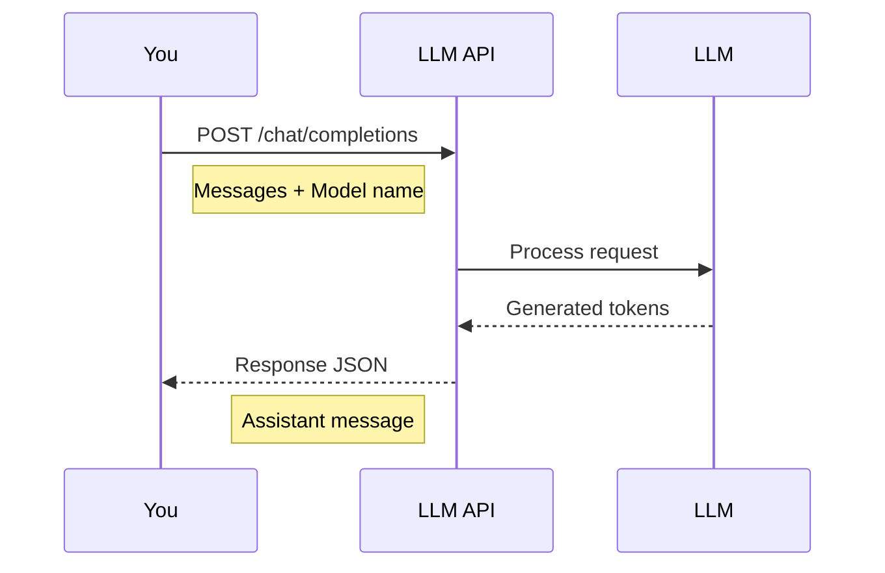

# LLM APIs Explained

When you use ChatGPT, the model does **not** run on your device.

## Where Does the LLM Actually Run?

Instead of running locally:

- The model runs on **powerful servers** (GPUs / TPUs)
- You send your input over the internet
- The server runs inference (the prediction process)
- You receive the generated output

From a developer's perspective, this interaction happens through an **HTTP API**.

## The Basic Mental Model

Think of an LLM API like a very smart function hosted remotely:

```
Your Code ──► HTTP Request ──► Model Server ──► HTTP Response ──► Your Code
```

You:

1. Send structured input (messages)
2. Specify which model to use
3. Receive a structured response

The network complexity is hidden — you just make a function call.

## Why APIs Instead of Local Models?

Running LLMs locally is possible but challenging:

| Approach | Pros | Cons |
|----------|------|------|
| **API** | Easy setup, no hardware needed | Costs money, requires internet |
| **Local** | Free after setup, private | Needs powerful GPU, complex setup |

For learning and most applications, APIs are the practical choice.

## Common LLM API Providers

| Provider | Description |
|----------|-------------|
| **OpenAI** | GPT-4, GPT-3.5 — Industry standard |
| **OpenRouter** | Routes to many models via one API |
| **Anthropic** | Claude models |
| **Google** | Gemini models |

Artemis supports both **OpenAI** and **OpenRouter**, making it easy to switch between providers.

## What Happens in an API Call?

When you call an LLM API:



The entire token prediction loop happens on the server. You just see the final result.

---

## Key Takeaways

- LLMs run on remote servers, not your device
- You communicate with them via HTTP APIs
- APIs hide the complexity of model inference
- Multiple providers offer similar interfaces

---

**Next:** [API Keys and Authentication](/talking-to-llms/api-keys-and-auth)
