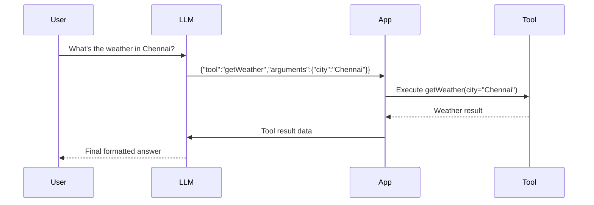

# Tool Calling

Tool calling is what transforms a passive LLM into an active agent.

## The Problem

LLMs have significant limitations:

- Cannot access the internet
- Cannot query databases
- Cannot call APIs
- Cannot execute code
- Cannot check current time or weather

Yet, we *want* them to behave as if they can.

**Tool calling is the bridge.**

## What is Tool Calling?

Tool calling is a pattern where:

1. The LLM **decides** a tool should be used
2. The LLM outputs a **structured JSON instruction**
3. Your code executes the tool
4. The result is sent back to the LLM
5. The LLM formats a final response

:::info Key Insight
The model never *executes* tools — it only **describes intent**. Your code does the actual execution.
:::

## The Tool Calling Loop

This loop is the **core of agentic AI**.

## Why This Pattern?

This design provides:

| Benefit | Description |
|---------|-------------|
| **Safety** | LLM can't run arbitrary code — only approved tools |
| **Control** | You decide what tools exist and how they work |
| **Extensibility** | Add new capabilities by adding tools |
| **Transparency** | Tool calls are visible and auditable |

## What You'll Learn

In this section:

| Page | Topic |
|------|-------|
| [Why Tool Calling](/talking-to-llms/tool-calling/why-tool-calling) | Deep dive into the motivation |
| [Defining Tools](/talking-to-llms/tool-calling/defining-tools) | How to create and register tools |
| [The Execution Loop](/talking-to-llms/tool-calling/tool-execution-loop) | Step-by-step implementation |

---

**Continue to:** [Why Tool Calling](/talking-to-llms/tool-calling/why-tool-calling)
