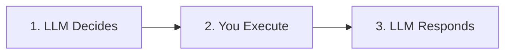

# The Tool Execution Loop

Now let's implement the complete tool calling flow.

## The Three-Step Process



1. **LLM Decides**: Model outputs a tool call request
2. **You Execute**: Your code runs the tool
3. **LLM Responds**: Model uses the result to answer

## Step 1: Let the Model Decide

Send a user message and let the LLM decide if a tool is needed:

```python
first_response = call_llm([
    {"role": "system", "content": SYSTEM_PROMPT},
    {"role": "user", "content": "What's the weather in Chennai?"}
])

tool_call_str = first_response["choices"][0]["message"]["content"]
```

The LLM might respond with:

```json
{
  "tool": "getWeather",
  "arguments": { "city": "Chennai" }
}
```

At this point:

- The model has **not answered the user**
- It has only expressed **intent** to use a tool

## Step 2: Execute the Tool

Parse the LLM's response and execute the requested tool:

```python
import json

# Parse the tool call
tool_call = json.loads(tool_call_str)

# Look up and execute the tool
tool_name = tool_call["tool"]
tool_func = TOOLS[tool_name]
tool_result = tool_func(tool_call["arguments"])

print(tool_result)
# {"city": "Chennai", "temp": 32, "condition": "Humid"}
```

Now you have real data to give back to the LLM.

## Step 3: Send the Result Back

Give the tool result to the LLM so it can format a final answer:

```python
final_response = call_llm([
    {"role": "system", "content": SYSTEM_PROMPT},
    {"role": "user", "content": "What's the weather in Chennai?"},
    {"role": "assistant", "content": tool_call_str},
    {"role": "user", "content": f"Tool result: {json.dumps(tool_result)}"}
])

answer = final_response["choices"][0]["message"]["content"]
print(answer)
# "The weather in Chennai is 32°C and humid."
```

Now the model produces a **human-readable answer** using real data.

## The Complete Flow

```python
def ask_with_tools(user_message: str) -> str:
    # Step 1: Ask LLM (might request a tool)
    first_response = call_llm([
        {"role": "system", "content": SYSTEM_PROMPT},
        {"role": "user", "content": user_message}
    ])
    
    assistant_content = first_response["choices"][0]["message"]["content"]
    
    # Check if it's a tool call
    try:
        tool_call = json.loads(assistant_content)
        if "tool" in tool_call:
            # Step 2: Execute the tool
            tool_func = TOOLS[tool_call["tool"]]
            tool_result = tool_func(tool_call["arguments"])
            
            # Step 3: Get final answer
            final_response = call_llm([
                {"role": "system", "content": SYSTEM_PROMPT},
                {"role": "user", "content": user_message},
                {"role": "assistant", "content": assistant_content},
                {"role": "user", "content": f"Tool result: {json.dumps(tool_result)}"}
            ])
            return final_response["choices"][0]["message"]["content"]
    except json.JSONDecodeError:
        pass
    
    # No tool needed, return direct response
    return assistant_content
```

## What This Unlocks

This pattern unlocks everything:

- Web search
- Memory retrieval
- Database queries
- File processing
- Scheduling tasks
- Multi-step reasoning

An **agent** is simply:

> An LLM + tools + memory + control flow

---

## Chapter Summary

In this chapter, you learned:

- LLMs run on remote servers accessed via APIs
- API keys authenticate your requests
- Chat completion format structures conversations
- Tool calling lets LLMs express intent
- The three-step loop: decide → execute → respond

---

## What's Next

Now that you understand how to talk to an LLM and enable tool calling, it's time to organize this into a proper **agent architecture**.

In the next chapter, you'll learn:

- Why an agent layer exists
- How tools are registered in Artemis
- How conversation history is managed
- How to connect an agent to a UI

**Continue to:** [Building Agents](/building-agents)
