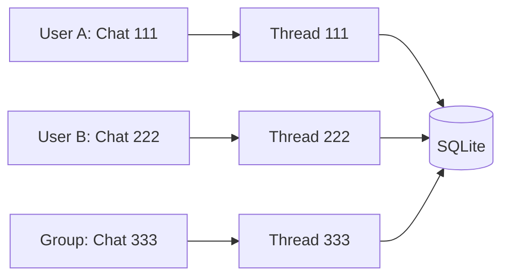

# Multi-User Handling

Telegram naturally supports multiple users. Your agent needs to handle them correctly.

## The Thread ID Solution

Telegram provides `update.effective_chat.id` — a unique identifier for:

- Private chats (1:1 with your bot)
- Group chats (multiple users)
- Channels

Artemis uses this as the `thread_id`:

```python
thread_id = update.effective_chat.id
```

## How Thread ID Maps to Memory

```
Chat ID → Agent thread_id → SQLite checkpoint
```

Each chat gets its own isolated conversation history.



## What This Guarantees

| Guarantee | Description |
|-----------|-------------|
| **Isolation** | User A never sees User B's history |
| **Persistence** | Conversations survive restarts |
| **Group context** | Group chats share one thread |
| **Scalability** | Works for thousands of users |

## Private vs Group Chats

### Private Chats

```
Chat ID = User's unique ID
Thread = Personal conversation with that user
```

### Group Chats

```
Chat ID = Group's unique ID
Thread = Shared conversation for the group
```

In groups, all members share the same memory. The bot sees messages from everyone.

## The Message Handler

```python
def handle_message(agent: Any, last_message: str, user_id: int):
    request = [HumanMessage(last_message)]

    response = agent.invoke(
        {"messages": request},
        {"configurable": {"thread_id": str(user_id)}}
    )

    return response["messages"][-1].content
```

Notice:

- Only the new message is sent
- Full history is loaded from SQLite
- Context trimming happens automatically
- The UI (Telegram) does not manage memory

## Concurrent Requests

Multiple users messaging simultaneously is handled automatically:

1. Telegram receives messages asynchronously
2. Each invokes the message handler
3. Each uses its own thread ID
4. SQLite handles concurrent access

No special code needed for concurrency.

---

## Key Takeaways

- Telegram chat IDs become agent thread IDs
- Each chat gets isolated conversation memory
- Private and group chats work seamlessly
- Concurrent users are handled automatically

---

**Next:** [Wiring It Together](/telegram-integration/wiring-it-together)
