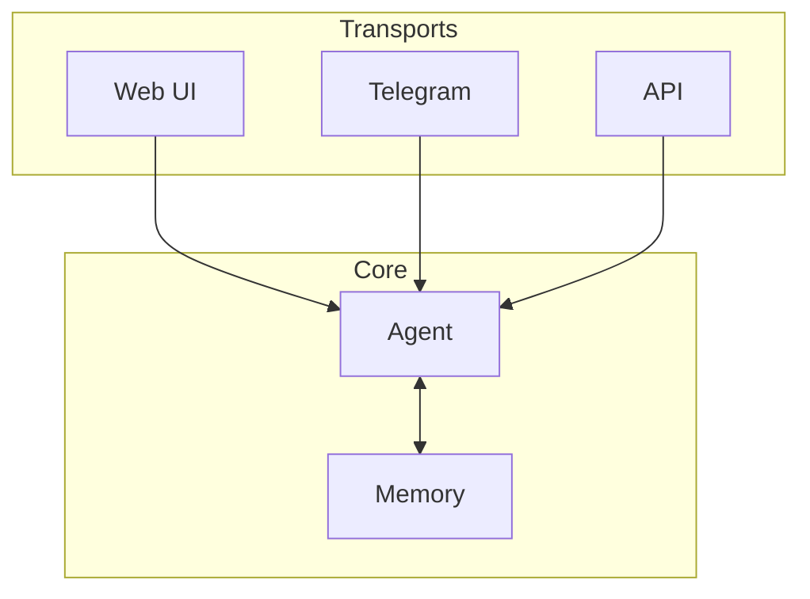

# Why Telegram?

Before building the integration, let's understand why Telegram is an ideal first platform.

## Telegram's Strengths for Agents

| Strength | Description |
|----------|-------------|
| **Text-native** | Conversations are already text — perfect for LLMs |
| **Identity built-in** | Every user and chat has a unique ID |
| **Always online** | Bots run 24/7 without maintenance |
| **Push-based** | Users get notified of responses |
| **Multi-user** | Test with real concurrent users |
| **Group support** | Add your bot to group chats |

## Comparison to Web UI

| Aspect | Web UI (Gradio) | Telegram |
|--------|-----------------|----------|
| Availability | Only when running | Always on |
| Users | Usually one | Many concurrent |
| Sessions | Browser-based | Chat-based |
| Notifications | None | Push notifications |
| Mobile | Needs responsive design | Native app |

## What Telegram Forces You to Handle

Building for Telegram exposes real-world requirements:

### 1. Identity

Every message comes with a user ID and chat ID. You must decide:

- Is this a private chat?
- Is this a group?
- Who is speaking?

### 2. Concurrency

Multiple users message simultaneously. Your agent must:

- Handle requests in parallel
- Keep state isolated
- Not mix up conversations

### 3. Persistence

Users expect continuity:

> "I told you my name yesterday"

Without persistence, they'll be disappointed.

## The Same Agent, Different Interface

The key insight:

> **The agent logic doesn't change. Only the transport layer changes.**

This is why we separated concerns in earlier chapters.

---

## Key Takeaways

- Telegram is text-native and always online
- It provides identity and multi-user support out of the box
- Building for Telegram exposes real-world requirements
- The same agent works across different interfaces

---

**Next:** [Creating a Bot with BotFather](/telegram-integration/creating-bot-botfather)
