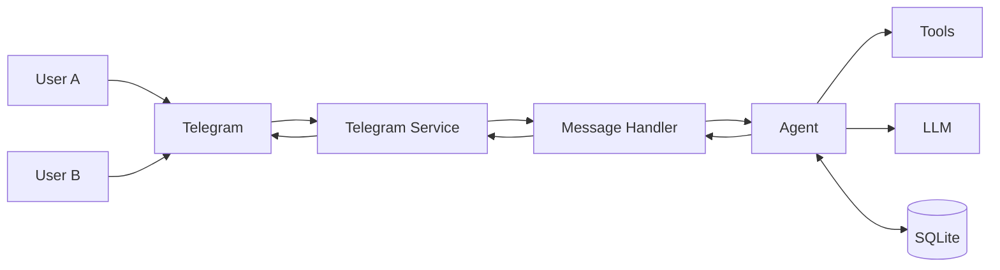

# Wiring It Together

Now let's connect all the pieces.

## The Updated Entry Point

`backend/main.py`:

```python
from load_dotenv import load_dotenv
load_dotenv()

from backend.agent.message_handler import handle_message
from backend.agent import build_agent
from backend.services.telegram import Telegram
from langgraph.checkpoint.sqlite import SqliteSaver


if __name__ == "__main__":
    with SqliteSaver.from_conn_string("./db/short_memory.db") as checkpointer:
        agent = build_agent(checkpointer)

        telegram = Telegram(
            on_message=lambda prompt, thread_id:
                handle_message(agent, prompt, thread_id)
        )

        telegram.start()
```

## Breaking Down the Flow

### 1. Load Environment Variables

```python
from load_dotenv import load_dotenv
load_dotenv()
```

Loads API keys from `.env`.

### 2. Set Up Persistent Storage

```python
with SqliteSaver.from_conn_string("./db/short_memory.db") as checkpointer:
```

Creates SQLite-backed conversation storage.

### 3. Build the Agent

```python
agent = build_agent(checkpointer)
```

Creates the agent with tools, memory, and middleware.

### 4. Connect to Telegram

```python
telegram = Telegram(
    on_message=lambda prompt, thread_id:
        handle_message(agent, prompt, thread_id)
)
```

Wires Telegram messages to the agent.

### 5. Start Polling

```python
telegram.start()
```

Begins listening for messages.

## The Complete Architecture



One agent instance. Many users. Isolated memory.

## Running the Bot

```bash
python -m backend.main
```

You should see:

```
Telegram AI bot is running!
```

Now message your bot on Telegram — it will respond using the same agent logic from the web UI.

## Testing It Works

1. **Send a message**: "Hello, my name is Alice"
2. **Check response**: Should acknowledge your name
3. **Send another**: "What's my name?"
4. **Verify memory**: Should remember "Alice"
5. **Use another chat**: Start a new conversation
6. **Verify isolation**: New chat shouldn't know the name

## What You've Built

By the end of this chapter, Artemis:

- Runs as a Telegram bot
- Handles multiple users safely
- Persists memory per chat
- Respects context window limits
- Reuses the same agent logic everywhere

This is a **huge architectural milestone**.

---

## Chapter Summary

In this chapter, you learned:

- Telegram forces correct identity handling
- `thread_id` is the foundation of multi-user agents
- Transport layers must stay stateless
- Memory belongs to the agent, not the UI
- The same agent can power many interfaces

---

## What's Next

Now that Artemis operates in the real world, harder problems emerge:

- Not every message deserves to be remembered
- Some information should persist longer than others
- Users expect the agent to "know" them

Future chapters will explore:

- Short-term vs long-term memory
- Structured user facts
- Retrieval-based memory (RAG)
- Multi-step reasoning

**Continue to:** [Roadmap](/roadmap)
