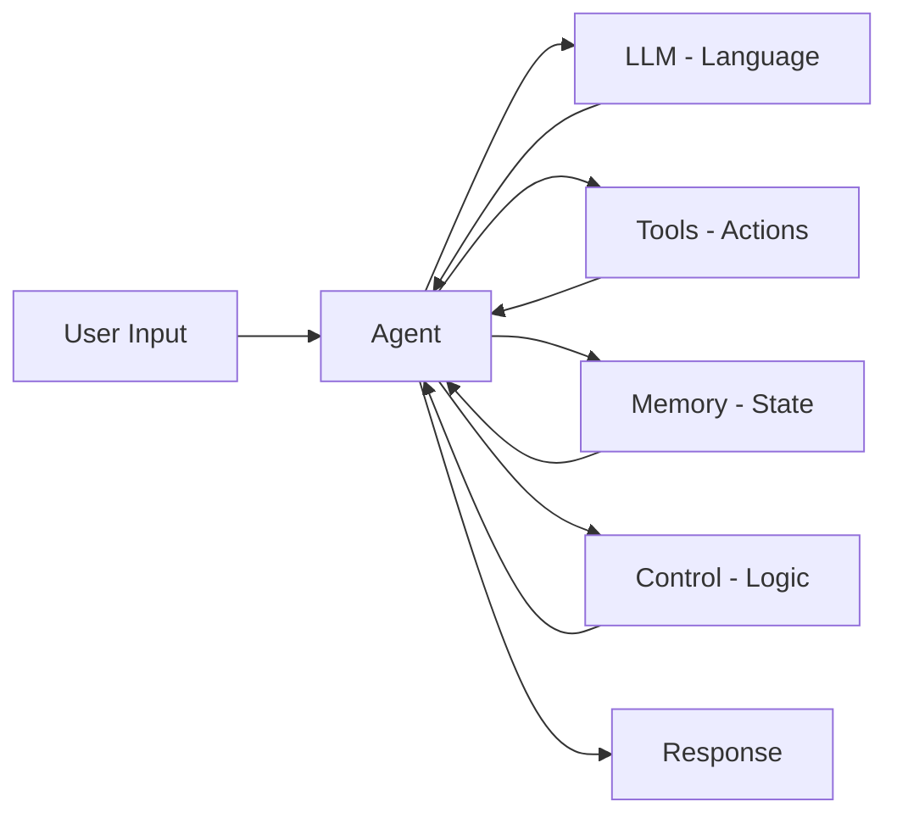

# Are LLMs Intelligent?

This is perhaps the wrong question. A better one is:

> **Can statistical pattern prediction produce intelligent-seeming behavior?**

## What LLMs Don't Do

LLMs:

- Do not reason like humans
- Do not "know" facts
- Do not understand meaning
- Do not have goals or intentions
- Do not remember previous conversations (by default)

They are sophisticated pattern matching systems that predict likely next tokens based on training data.

## What LLMs Do Well

Yet, when combined with the right systems, LLMs can:

- Generate coherent, contextual responses
- Follow complex instructions
- Produce code, essays, and creative content
- Maintain consistent "personality" within a conversation
- Adapt their output style based on prompts

## The Emergence of "Reasoning"

When you combine an LLM with:

- **Memory** — Store and retrieve past interactions
- **Tools** — Execute real actions (search, calculate, API calls)
- **Retrieval** — Fetch relevant information dynamically
- **Constraints** — Enforce rules and formats
- **Feedback loops** — Iterate on outputs

You get systems that **simulate reasoning extremely well**.

This is exactly where **agentic systems** begin.

## The Agent Formula

An **agent** is simply:

```
Agent = LLM + Tools + Memory + Control Flow
```

The LLM provides language understanding and generation. Everything else provides grounding in reality.



## Why This Perspective Matters

Understanding that LLMs are prediction engines (not reasoning engines) helps you:

1. **Set realistic expectations** — Know what LLMs can and can't do alone
2. **Design better systems** — Build the scaffolding that makes them useful
3. **Debug effectively** — Understand why outputs sometimes don't make sense
4. **Avoid over-reliance** — Know when human oversight is needed

---

## Chapter Summary

In this chapter, you learned:

- LLMs predict tokens based on statistical patterns
- They operate on tokens, not words
- Text is generated one token at a time in a loop
- LLMs are not intelligent, but can simulate intelligence with proper scaffolding
- Agents combine LLMs with tools, memory, and control flow

---

## What's Next

Now that you understand what LLMs are, it's time to learn how to **communicate with them through code**.

In the next chapter, you'll explore:

- How LLMs are accessed through APIs
- What API keys are and why they exist
- How chat-completion APIs work
- How **tool calling** enables agents to take actions

**Continue to:** [Talking to LLMs](/talking-to-llms)
