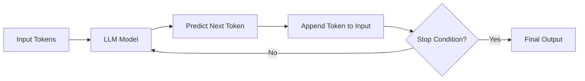

# The Token Generation Loop

Now that you understand tokens, let's see how LLMs actually generate text.

## Step-by-Step Generation

Let's say we provide the model with this input:

> "The sky is"

Here's what happens:

1. **Step 1**: Model predicts the most likely next token → `"blue"`
2. **Step 2**: Input becomes `"The sky is blue"` → Model predicts → `"."`
3. **Step 3**: Input becomes `"The sky is blue."` → Model predicts → (stop token)

This loop continues until a stopping condition is met.

## The Loop Visualized



### Key Insight

The model is **not generating text all at once**. It predicts **one token at a time**, repeatedly.

This is why you see responses appear sequentially in chat interfaces like ChatGPT.

## When Does Generation Stop?

The loop stops when one of these conditions is met:

| Condition | Description |
|-----------|-------------|
| **Stop token** | Model predicts a special "end" token |
| **Max tokens** | Reaches the configured limit |
| **Stop word** | A custom stop sequence is detected |

### Example: Stop Token

In conversational systems, the model learns that a response should end after completing a thought. It predicts a special stop token that signals completion.

## Why This Matters for Chat

Most modern LLM applications don't send a single sentence. They send an **entire dialog history**:

```text
user: What is an LLM?
assistant: An LLM is a large language model trained to predict tokens.
user: How does it work?
assistant:
```

The model's task is simply:

> **Predict what comes after `assistant:`**

Each token prediction references all the text that came before it. This is how the model maintains context within a conversation.

## Token-by-Token Example

Here's a real dialog flow:

### Input Sent to the Model

```text
system: You are a helpful AI assistant.
user: Explain what an LLM is in simple terms.
assistant:
```

### Model Prediction (Token by Token)

```text
assistant: An
assistant: An LLM
assistant: An LLM is
assistant: An LLM is a
assistant: An LLM is a model
...
```

Each step is a **probability-based token prediction**, not a pre-planned sentence.

---

## Key Takeaways

- LLMs generate one token at a time in a loop
- Each prediction uses all previous text as context
- Generation stops at a stop token, max limit, or stop word
- Chat history is replayed to create the illusion of memory

---

**Next:** [Are LLMs Intelligent?](/understanding-llms/are-llms-intelligent) — Understanding the nature of LLM "reasoning"
